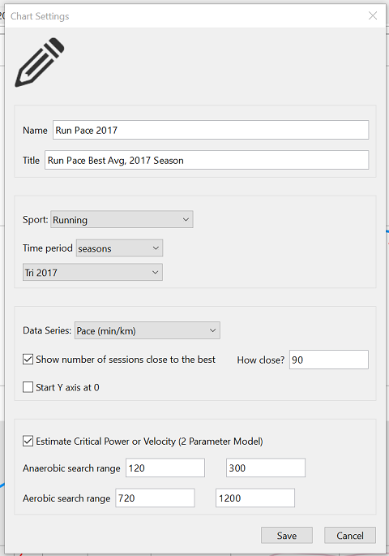
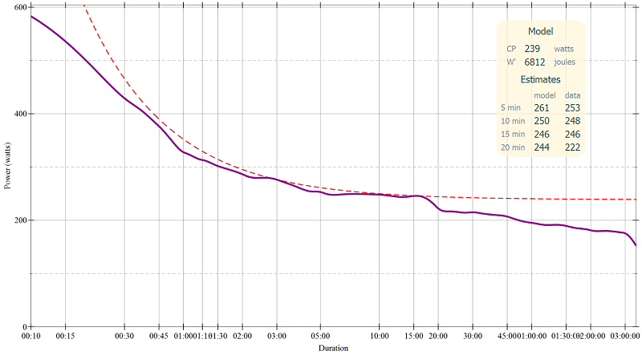

# Overview

The Critical Power model allows estimating the maximum power that can be
maintained for a given duration.  For running, it can estimate the maximum
speed that can be maintained for a given duration.  It is useful when
designing interval workouts, estimate finish time for running races, and for
estimating and modeling exhaustion.

The ActivityLog2 application supports

* estimate Critical Power parameters (CP and W') from Mean Maximal power or
  pace data (the Best Avg plot)

* calculate maximum power or pace that can be maintained for several durations
  and distances based on CP and W'

* model the W' depletion and reconstitution during an activity, helping to
  determine how close to exhausion the athlete was during the activity.

The CP model uses two parameters, and the W' reconstitution introduces a third
parameter, Tau:

* Critical Power (**CP**) or Critical Velocity (**CV**) is a value
  representing the threshold between hard, but sustainable, and very hard and
  unsustainable work.  Basically, work done above CP or CV can only be done
  for short amounts of time before exhaustion.  CP is measured in watts, CV is
  measured in meters/second.

* **W'** or **D'** is the amount of work that can be done above CP or CV.  For
  power, W' is measured in Joules, for speed, D' is measured in meters.
  
* **Tau** is the time constant for recovering W' that was depleted during an
  activity.  It represents the amount of time it takes to recover 83% of
  depleted W' while at rest.  There is no estimate for this parameter, but a
  value of 300 (5 minutes) seems to work.  See below for a discution on this
  parameter.

If you are new to the Critical Power
concept, [this short video](https://www.youtube.com/watch?v=86Sw3vOCq9U) by
Dr. Phil Skiba explains Critical Power and W' and how they are depleted and
recharged during a workout.  The "Annotated References" section at the end
also contains some more information about these concepts.

The **Technicalities** section below provides more info about the actual
algorithms involved.

# How to Detemine CP and W'

To determine the CP and W' parameters the "power" or "pace" to exhaustion
needs to be known for two separate durations.

**Warning** The literature contains several test protocols for determining CP
and W' and seems to be highly opinionated about which methods are best.

A good test protocol would be:

* on one day, do a warm-up followed by 5 minutes at the maximum power or pace
  that you can maintain for these 5 minutes, followed by a cool down (or some
  other work)
* on another day (preferably close to the first test), do a similar workout,
  but this time use the maximum power or pace that you can maintain for 20
  minutes.

Try to maintain a positive split, that is, go harder than you think you can
and don't worry about slowing down at the end.  There is no need worry about
recording laps or separating the warm-up portion from the actual test portion,
as ActivityLog2 can automatically search these for these intervals and
estimate CP and W' from them.  Also, it is not important to hit the exact
times, as ActivityLog2 uses a time range and finds the best match in this time
range.

Once the activities have been imported into ActivityLog2, Critical Power and
W' (or Critical Velocity and D' for running activities) can be determined
using the Best Avg Plot available in the Trends tab.  In the setup box for the
plot, make sure that "Estimate Critical Power or Velocity" is selected, this
check-box is only enabled for Pace or Power series:



ActivityLog2 will find two best effort points on the Best-Avg curve and will
solve the Critical Power equation for these two points.  The resulting CP
function will be compared against the Best-Avg curve and the function that
best approximates the rest of the data is selected.  The first point is looked
up in the 2 - 5 minute range (120 - 300 seconds) and the second point is
looked up in the 12 - 20 minute range (720 - 1200 seconds), and these search
intervals can be adjusted.

This is what they look for bike power and for running pace:




A few remarks:

* It is important to have maximal efforts on the best-avg plot, in the two
  search ranges, as the estimate will only be as good as the available data.
  ActivityLog2 does not know if the plot contains true bests or not, and will
  always provide some estimates for these parameters.

* Both CP and W' improve with training (and degrade with lack of training).
  The CP estimation will be valid for the date-range selected in the plot
  setup dialog box, and perhaps for a short period after that.  In particular,
  do not use last seasons bests or the all time bests to estimate the values
  for the current season!

* The Best Avg plot provides some estimates of maximum power at different time
  intervals.  You can use these estimates to try to "beat" these and see if
  the CP and W' have improved.

# W'Bal -- Modeling W' Depletion and Reconstitution

The W' (or D') is depleted when work is done above CP (or CV) and recovered
when work is done under the threshold.  This can be plotted as a chart for an
activity, the chart name is **W'Bal**.

To make the W'Bal plot available, CP and W' parameters must be defined for the
time of the activity, look in the "Athlete/Edit Critical Power..." menu.  The
dialog allows specifying these values for several time intervals.

You can use a critical power estimation trends plot as discussed above, but
you need to put in these values yourself.  This is because an estimation plot
can be setup for any time interval (for example the previous years season) and
ActivityLog2 does not track this information.

# Technicalities

## The Model

The Critical Power concept defines a relationship between the total work that
can be performed by an athlete in a given amount of time, as the formula:

```
W(t) = CP * t + W'                                     (1)
```

Where `W(t)` is the total work that can be done in time `t`, `W'` is the
anaerobic work capacity, or work that can be done above critical power, and
`CP` is the critical power.  For bike activities, work is measured in Joules,
and power in Watts, for running activities, work is measured in meters (a
distance) and power in meters/second (a speed).

Given that the work performed is the product of power and time, formula (1)
can be rewritten as:

```
W(t) = P(t) * t = CP * t + W'                          (2)
P(t) = CP + W' / t                                     (3)
```

Formula (3) is useful in estimating the maximum power (or pace) that can be
maintained for a given period of time.  For example:

```
Given CP = 250 watts and W' = 13000 J                  (4)

Time             | Max Power
-----------------|------------------------------
180 sec (3 min)  | 250 + 13000 / 180 = 322 watts
300 sec (5 min)  | 250 + 13000 / 300 = 293 watts
900 sec (15 min) | 250 + 13000 / 900 = 264 watts
```

The same formula works for running, for example:

```
Given CP = 4:35 min/km (3.64 m/s), W' = 95 meters      (5)

Time             | Max Pace
-----------------|-----------------------------------------
180 sec (3 min)  | 3.64 + 95 / 180 = 4.17 m/s (4:00 min/km)
300 sec (5 min)  | 3.64 + 95 / 300 = 3.96 m/s (4:13 min/km)
900 sec (15 min) | 3.64 + 95 / 900 = 3.75 m/s (4:27 min/km)
```

## Limitations

Readers with math background will quickly realize that formula (3) does not
work well when trying to estimate maximum power for very short or very long
time intervals.  Here are some examples:

```
Given CP = 250 watts and W' = 13000 J                  (6)

Time                 | Max Power
---------------------|-----------------------------------
1 sec                | 250 + 13000 / 1 = 13250 watts
86400 sec (24 hours) | 250 + 13000 / 86400 = 250.15 watts
```

The issue is best summarized by [^1]:

> The notion of "infinite" endurance is a somewhat nebulous one. It is not
> uncommon that long-duration continuous exercises of moderate power output
> are terminated for a variety of non-energy-substrate related reasons, such
> as boredom, psychological issues, the necessity to eat, drink or
> toilet. This therefore places an imprecise upper limit to the time domain
> over which the CP model applies. In similar vein very short time intervals
> at very high power (even if less than P max ) are not realistic
> either. Factors like overcoming inertia and acceleration come into consider-
> ation. Strictly speaking of course, if exercise at P max or more was to be
> attempted, endurance time should be zero.

There are a lot of experimental studies which indicate that the formula works
well for "reasonable" time ranges.  What is "reasonable" is not clearly
defined, but it seems that it can be applied for durations from 2 - 3 minutes
up to about 1 hour.  For intermittent exercise, with some periods above
critical power and some below critical power, the total durations can be even
longer.

## Determining CP and W'

The implementation for the CP estimation code is in the "./rkt/pdmodel.rkt"
file.  Below is an overview on how CP and W' are actually determined.

Solving CP, W' is done by looking at the best power (or speed) at two data
points.  The following explains how these parameters are determined:

The equation:

```
P(t) = CP + W' / t
```

Can be re-written as

```
P(t) * t = CP * t + W'
```

Given that `P(t) * t` is the work performed at time `t`, `CP` and `W'` can be
determined given two values for work at two different time points:

```
W(t1) = CP * t1 + W'
W(t2) = CP * t2 + W'
```

so:

```
CP = (W(t2) - W(t1)) / (t2 - t1)
W' = W(t1) - CP * t1
```

## Modeling W' Depletion and Reconstitution

> ActivityLog2 implements `W'Bal` based on the Golden Cheetah differential
> model, with some updates.  The Skiba `W'Bal` model is not implemented at
> this time.

The amount of W' available at each point during an activity can be modeled by
calculating a W' depletion or reconstitution amount for each data point and
keeping a running sum for them.  This is done as follows:

* If the Power or Pace for the data point is above CP or CV, the amount of W'
  used is given by the formula (this is determined from the Critical Power
  formula above):

```
W'Exp = (P - CP) * dt                             (7)
W'Bal = W'Bal - W'Exp                             (8)
```

* If the Power or Pace for the data point is below CP or CV, W' is
  reconstituted:

```
W'Rec = (CP - P) * dt                             (9)
Rate = (W' - W'Bal) / W'                          (10)
W'Bal = W'Bal + W'Rec * Rate                      (11)
```
    
A few notes on the reconstitution amount:

* The reconstitution amount (9) depends on how much below CP (or CV) one is
  recovering at.  The lower the recovery power or speed, the bigger W'Rec is.
  To put it differently, you recover faster at lower power output or speed.
  
* The reconstitution rate (10) depends on how much W' was spent.
  Reconstitution is faster the more W' is depleted and slower when W' is
  almost recovered.
  
The W' reconstitution rate is a bit too fast using this formula, that is, the
model indicates that the athlete recovers very fast.  To slow down the
recovery rate, a **Tau** constant is introduced, representing the amount of
time it takes to replenish 63% of expended W'.  The replenishment is
exponential, that is, in the first "Tau" period, 63% of W'Bal is replenished,
in the second "Tau" period, 63% of the remaining W'Bal is replenished and so
on.

Formula (11) has an implicit Tau of "WPrime / CP" (63% of W' is recovered in
WPrime / CP seconds).  If there is an explicit Tau defined in the "Critical
Power" settings, formula (11) is updated as:

```
TauRate = (WPrime / CP) / Tau                   (12)
W'Bal = W'Bal + TauRate * W'Rec * Rate          (13)
```

There is no good way to estimate Tau in this formula, but a value of 300 (5
minutes) seems to work well.

# Annotated References

* A short (6 minute) video by Dr. Phil Skiba explaining the critical power and
  W' concepts and how they are depleted and recharged during a workout:
  [https://www.youtube.com/watch?v=86Sw3vOCq9U](https://www.youtube.com/watch?v=86Sw3vOCq9U)

* A short article about Critical Power and how it relates to other thresholds
  [http://physfarm.com/new/?page_id=511](http://physfarm.com/new/?page_id=511)

* ... and another one explaining how W' is depleted and reconstituted,
  [http://physfarm.com/new/?page_id=563](http://physfarm.com/new/?page_id=563)
  
[^1] "The critical power and related whole-body bioenergetic models", Morton,
R.H. Eur J Appl Physiol (2006) 96: 339. doi:10.1007/s00421-005-0088-2
